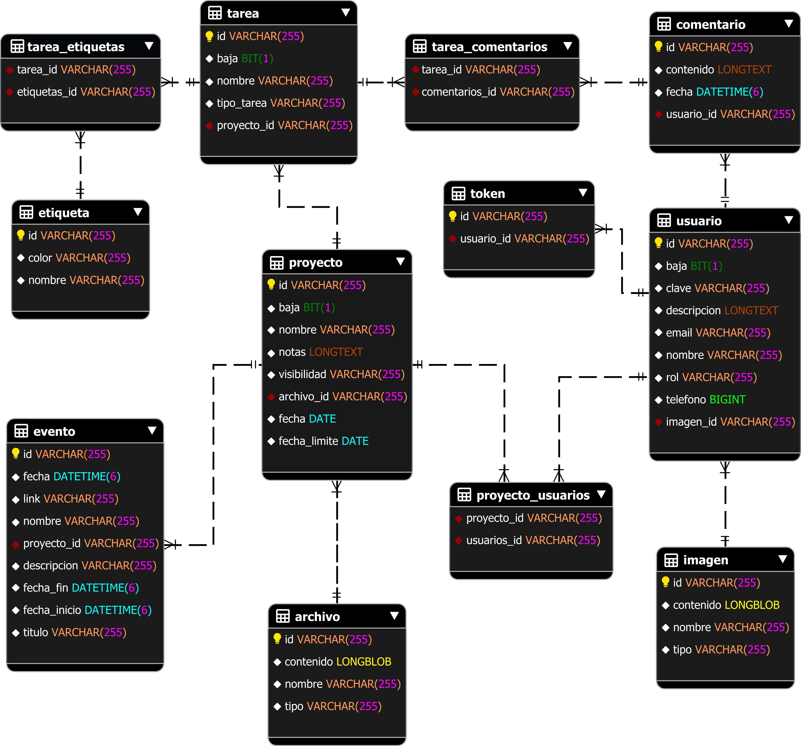

# Petru

Proyecto final realizado en el marco del quinto tramo del curso fullstack de EGG Cooperation. EQUIPO "P"

## Miembros del proyecto:

### •	[Sebastian Petrini](https://github.com/sebapetrini):

> Lider Tecnico

> Desarrollador Back-end

### •	[Salvador Caldarella](https://github.com/Salvatury):

> Agile Delivery Manager

> Desarrollador Front-end

### •	[Maximo Carbonetti](https://github.com/maximocarbonetti):

> Desarrollador Front-end

> Photoshop

### •	[Manuel Dominich Martinez](https://github.com/Dominiciss):

> Desarrollador Front-end

### •	[Cecilia Alsina](https://github.com/Ceci-Alsina):

> Desarrollador Front-end

### • [Dario Litterio](https://github.com/Darioezequiel17):

> Desarrollador Back-end

### •	[Flavio Romero Averna](https://github.com/flavioav):

> Scrum master

> Desarrollador Front-end

### •	[Juan Pablo Pontini](https://github.com/juampi21):

> Desarrollador Front-end

### •	[Matias Quispe](https://github.com/matias4280):

> Desarrollador Back-end

### •	[Nahiara Denice Alegre](https://github.com/NahiDenice):

> Desarrollador Back-end
 
## Requerimientos del proyecto:

● Registro y Login con Spring Security

● Crear al menos DOS roles distintos para los usuarios.

● Incluir tabla html en alguna vista

● Carga y actualización de imagen

● Crear una Query de búsqueda personalizada

● Crear un CRUD

● Que haya al menos un formulario.

● Crear al menos 3 vistas distintas.

● Diagrama UML de entidades

● El ADMIN puede agregar proyectos, modificarlos y eliminarlos. Puede cambiar
el estado de los proyectos. Puede asignar a agentes al proyecto. Puede visualizar
el dashboard general. Puede crear cuentas de agentes y eliminarlas.

● El dashboard general de la empresa donde se ve el estado de los proyectos y
los colaboradores asociados. Se puede filtrar por empresa o tipo de proyecto.
Al hacer click se puede acceder a los proyectos individuales. Los agentes
colaboradores de proyecto pueden cambiar el estado del proyecto.

● El AGENTE puede acceder a su perfil y modificarlo. Cargar reuniones al
proyecto y estas pueden ser visualizadas por el cliente. Cargar proyectos,
modificarlos y darles de baja. El agente puede aceptar proyectos ya creados
sin agente asignado. Puede visualizar todos los proyectos y su avance, pero
no puede modificarlos ni darles de baja si no son propios.

● Cada AGENTE deberá tener un block de notas y to-do.

● El CLIENTE no puede cargar proyectos, solamente puede entrar a su perfil,
modificar datos de contacto, visualizar sus encargos con datos como quién
está a cargo del proyecto y acceder a su perfil para contactarlo, fecha de
entrega y fecha de reuniones próximas.

● Un CLIENTE puede registrarse como nuevo cliente, acceder a su perfil y
modificar sus datos, pero no podrá ver proyectos cargados a menos que se los
asocie a estos.

## Diagrama UML

